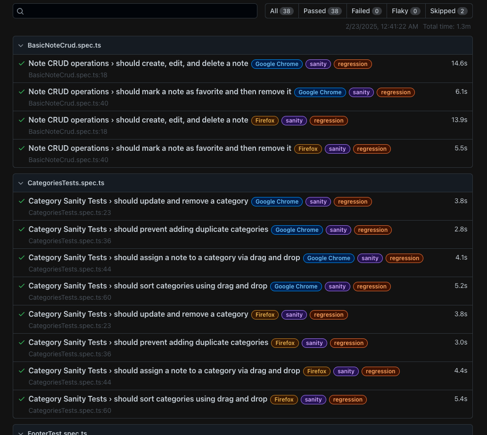

# TakeNote Assignment

This repository contains automated tests for the TakeNote application, including Playwright E2E tests, Artillery load tests, and ESLint configuration.

## Prerequisites

- Node.js (Latest LTS version recommended)
- npm (comes with Node.js)

## Installation

1. Clone the repository:
```bash
git clone https://github.com/Mshumaman/takenote-assignment.git
cd takenote-assignment
```

2. Install dependencies:
```bash
npm install
```

## Running Tests

### Playwright E2E Tests

The project uses Playwright for end-to-end testing. Here are the available commands:

1. Run tests in headed mode (one browser):
```bash
npm run oneBrowserHeaded
```

2. Run all tests in headless mode:
```bash
npx playwright test
```

3. Run tests in debug mode:
```bash
npx playwright test --debug
```

4. Generate and view HTML test report:
```bash
npx playwright show-report
```

### Load Tests (Artillery)

The project includes Artillery load tests located in the `load-tests` directory. Artillery tests have their own package.json configuration to avoid conflicts with ESLint module settings.

1. Run load tests:
```bash
npm run artillery
```

2. View the test report:
- At the end of the test run, Artillery will provide a link to view detailed test results in Artillery Cloud dashboard
- The Artillery Cloud dashboard provides comprehensive visualizations and analysis of your load test results

### ESLint

The project uses ESLint with Playwright plugin for code quality:

1. Run ESLint:
```bash
npm run lint
```

2. Fix auto-fixable issues:
```bash
npm run lint:fix
```

## Project Structure

- `/tests` - Playwright test files
- `/pages` - Page Object Models
- `/fixtures` - Test fixtures and data
- `/helpers` - Helper functions and utilities
- `/load-tests` - Artillery load test configurations
- `/config` - Configuration files
- `/types` - TypeScript type definitions

## Configuration Files

- `playwright.config.ts` - Playwright test configuration
- `eslint.config.js` - ESLint configuration
- `tsconfig.json` - TypeScript configuration
- `load-tests/artillery.yml` - Artillery load test configuration

## Test Reports

- Playwright reports are generated in the `playwright-report` directory
- To view the HTML report, run:
```bash
npx playwright show-report
```



## CI/CD

The project includes GitHub Actions workflows in the `.github` directory for automated testing. You can view the test execution history and results in the [GitHub Actions dashboard](https://github.com/Mshumaman/takenote-assignment/actions).